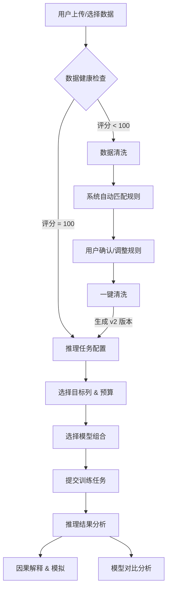

# LimiPreview 机器学习平台产品需求文档 (PRD)

| 文档版本 | 修改日期 | 修改人 | 修改内容 |
| :--- | :--- | :--- | :--- |
| V1.0 | 2025-12-26 | AI Assistant | 基于当前开发版本 (LimiPreview.jsx) 重构文档 |

---

## 1. 模块目标与定位

### 1.1 核心目标
本系统旨在为非算法专家用户提供**端到端的自动化机器学习 (AutoML) 解决方案**。通过向导式流程，解决数据质量评估难、清洗规则复杂、模型选型门槛高、结果解释性差等核心痛点。

### 1.2 系统定位
- **数据层**：提供轻量级的数据资产管理与即时质量评估。
- **特征工程层**：提供基于规则的自动化清洗与版本管理。
- **建模层**：集成 LimiX (数据大模型)、DeepSeek (LLM)、AutoGluon (AutoML) 多模态能力。
- **应用层**：提供可解释性分析 (XAI) 与业务模拟器。

---

## 2. 业务流程图



---

## 3. 功能模块详细说明

### 3.1 模块一：数据资产 (Datasets)

#### 3.1.1 用户操作流程
1.  **Step 1**: 进入“数据资产”页面。
2.  **Step 2**: 在左侧数据集列表中点击切换不同数据集（如 `电力预测_v1.csv`）。
3.  **Step 3**: 查看右侧数据概览（Schema 信息、预览数据）。

#### 3.1.2 系统行为说明
| 交互动作 | 前端行为 | 后端/系统行为 |
| :--- | :--- | :--- |
| **页面初始化** | 加载默认数据集列表；高亮选中第一个数据集。 | 异步拉取数据集元数据（行数、列数、大小）。 |
| **切换数据集** | 刷新右侧“数据概览”区域；重置后续流程状态（如清洗状态）。 | 读取选中 CSV 文件前 5 行作为预览数据。 |

#### 3.1.3 核心数据结构
**Dataset Metadata**
| 字段名 | 类型 | 示例 | 说明 |
| :--- | :--- | :--- | :--- |
| `id` | String | `ds_001` | 数据集唯一标识 |
| `name` | String | `日前电价预测_XGB` | 显示名称 |
| `size` | String | `2.4 MB` | 文件大小 |
| `rowCount` | Integer | `14,500` | 总行数 |
| `columns` | List | `['date', 'price', ...]` | 列名列表 |

---

### 3.2 模块二：数据评估 (Health Check)

#### 3.2.1 用户操作流程
1.  **Step 1**: 系统自动触发体检，用户查看“数据健康分”。
2.  **Step 2**: 查看具体问题卡片（缺失率、重复率、异常值、Schema 一致性）。
3.  **Step 3**: 点击“准备清洗”按钮进入清洗环节。

#### 3.2.2 系统行为说明
| 交互动作 | 前端行为 | 后端/系统行为 |
| :--- | :--- | :--- |
| **加载评估** | 展示评分仪表盘（颜色随分数变化：>80 绿, <60 红）。 | 计算全量数据的 Null 率、Duplication 率；识别数值型列的 3-Sigma 异常值。 |
| **点击准备清洗** | 路由跳转至“数据清洗” Tab。 | 传递当前 Dataset ID 及识别到的 Issue List 至清洗模块。 |

#### 3.2.3 异常与边界
- **空数据**：若数据集为空，健康分显示 0，提示“无法评估”。
- **满分数据**：若健康分 100，提示“数据完美，可直接训练”，“准备清洗”按钮仍可用但非必要。

---

### 3.3 模块三：数据清洗 (Data Cleaning)

#### 3.3.1 用户操作流程
1.  **Step 1**: 查看系统自动推荐的清洗规则列表（左侧面板）。
2.  **Step 2**: 点击“一键清洗”按钮。
3.  **Step 3**: 按钮状态变为“已清洗”，且不可再次点击。
4.  **Step 4**: 系统自动切换当前数据版本为 `data:v2`。

#### 3.3.2 系统行为说明
| 交互动作 | 前端行为 | 后端/系统行为 |
| :--- | :--- | :--- |
| **点击一键清洗** | 按钮文案由“一键清洗”变更为“清洗中…”(Loading) -> “已清洗”。<br>按钮置灰禁用 (Disabled)。 | 1. 执行去重 (Drop Duplicates)。<br>2. 执行缺失值填充 (Numeric: Mean/RF, Category: Mode)。<br>3. 生成新数据快照 `v2`。<br>4. 更新 Session 上下文中的 `currentVersion` 指向 `v2`。 |
| **重入页面** | 若组件未销毁，保持“已清洗”状态；若重新加载组件，重置为“一键清洗”。 | 检查 Session 中该数据集是否有 `v2` 版本。 |

#### 3.3.3 关键规则与约束
- **规则优先级**：`去重` > `缺失值处理` > `异常值处理`。
- **不可逆性**：当前版本不支持在界面上“撤销”清洗操作，需重新加载数据集重置。
- **按钮互斥**：在“清洗中”状态下，禁止重复提交请求。

#### 3.3.4 清洗规则枚举
| 规则类型 (Type) | 策略 (Strategy) | 参数说明 |
| :--- | :--- | :--- |
| `Deduplication` | `Drop` | 移除完全重复的行 |
| `MissingValue` | `RandomForest` | 使用随机森林回归填补数值缺失 |
| `MissingValue` | `Mode` | 使用众数填补类别缺失 |
| `Outlier` | `Clip` | 将超过 3σ 的值截断至边界值 |

---

### 3.4 模块四：推理任务 (Inference Tasks)

#### 3.4.1 用户操作流程
1.  **Step 1**: 在“新建任务”卡片中配置任务参数。
    - 输入任务名称。
    - 选择预测目标列 (Target Column)。
    - 设定时间预算 (Time Limit)。
2.  **Step 2**: 选择模型组合（默认全选）。
    - 选项：`LimiX (数据大模型)`, `AutoGluon (机器学习)`, `DeepSeek (大语言模型)`。
3.  **Step 3**: 点击“立即运行”按钮。

#### 3.4.2 系统行为说明
| 交互动作 | 前端行为 | 后端/系统行为 |
| :--- | :--- | :--- |
| **选择目标列** | 根据列数据类型自动推断任务类型：<br>- 数值型 -> 回归 (Regression)<br>- 离散型 -> 分类 (Classification) | 校验列名是否存在于当前数据版本 (`data:v2` 优先)。 |
| **点击立即运行** | 右侧任务列表新增一条状态为 `Pending` 的记录。 | 1. 创建 Task 实例。<br>2. 异步提交至计算集群。<br>3. 轮询更新状态 (`Pending` -> `Running` -> `Completed`)。 |

#### 3.4.3 核心配置结构 (Task Config)
```json
{
  "taskName": "String (Required)",
  "targetColumn": "String (Required)",
  "timeLimit": "Integer (Min: 60, Default: 3600)",
  "models": ["LimiX", "AutoGluon", "DeepSeek"],
  "problemType": "Enum(REGRESSION, CLASSIFICATION)"
}
```

---

### 3.5 模块五：推理结果 (Inference Results)

#### 3.5.1 用户操作流程
1.  **Step 1**: 选择已完成的任务 ID。
2.  **Step 2**: 查看核心指标卡片 (Metric Pills)。
    - 回归：RMSE, MAE, R2
    - 分类：Accuracy, F1, AUC
3.  **Step 3**: 查看“预测 vs 真实”趋势图。

#### 3.5.2 系统行为说明
- **动态置信区间**：趋势图中的阴影区域（置信区间）应随时间推移或数据波动动态计算，而非固定宽度。
- **指标展示**：根据任务类型（回归/分类）自动切换展示的指标集合。

---

### 3.6 模块六：对比分析 (Comparative Analysis)

#### 3.6.1 模块目标
直观对比不同技术路线（传统 ML vs 数据大模型 vs LLM）在同一任务下的表现差异。

#### 3.6.2 展示内容
- **LimiX vs AutoGluon**：侧重对比“数据大模型”与“传统 AutoML”在捕捉峰值和耗时上的差异。
- **LimiX vs DeepSeek**：侧重对比“专用模型”与“通用 LLM”在数值回归任务上的稳定性差异。
- **关键指标**：推理耗时 (Time Cost)、稳定性 (Stability)、拟合度。

#### 3.6.3 界面约束
- **必须**展示具体的耗时对比 Badge（如 `LimiX: 11s` vs `DeepSeek: 39s`）。
- **禁止**展示已废弃的“三模型综合对比卡片”（已在 T-102 任务中移除）。
- **文案约束**：DeepSeek 模型卡片中严禁出现单独的 "LLM" 字样，必须统一为 "DeepSeek"。

---

## 4. 异常与边界场景处理

| 场景 | 系统反馈 | 处理策略 |
| :--- | :--- | :--- |
| **数据清洗未完成直接训练** | 允许，但弹出 Toast 警告 | 默认使用 `v1` 原始数据进行训练，模型可能因缺失值报错。 |
| **目标列包含空值** | 阻断任务提交 | 提示“目标列 (Target) 存在缺失值，请先进行清洗”。 |
| **模型训练超时** | 任务状态置为 `Failed` | 日志记录 "Time Limit Exceeded"，不产出模型文件。 |
| **只选择了一个模型** | 允许 | 对比分析页面将显示“无对比数据”或隐藏对应对比图表。 |

## 5. 附录：枚举值字典

**Model Types**
| Key | Display Name | Description |
| :--- | :--- | :--- |
| `LIMIX` | LimiX | 专注于时序/表格数据的预训练大模型 |
| `AUTOGLUON` | AutoGluon | 基于集成学习的自动化机器学习框架 |
| `DEEPSEEK` | DeepSeek | 通用大语言模型，具备代码与逻辑推理能力 |

**Task Status**
| Key | Color | Description |
| :--- | :--- | :--- |
| `PENDING` | Gray | 排队中，等待资源 |
| `RUNNING` | Blue | 正在训练/推理 |
| `COMPLETED`| Green | 任务成功结束 |
| `FAILED` | Red | 任务执行出错 |

