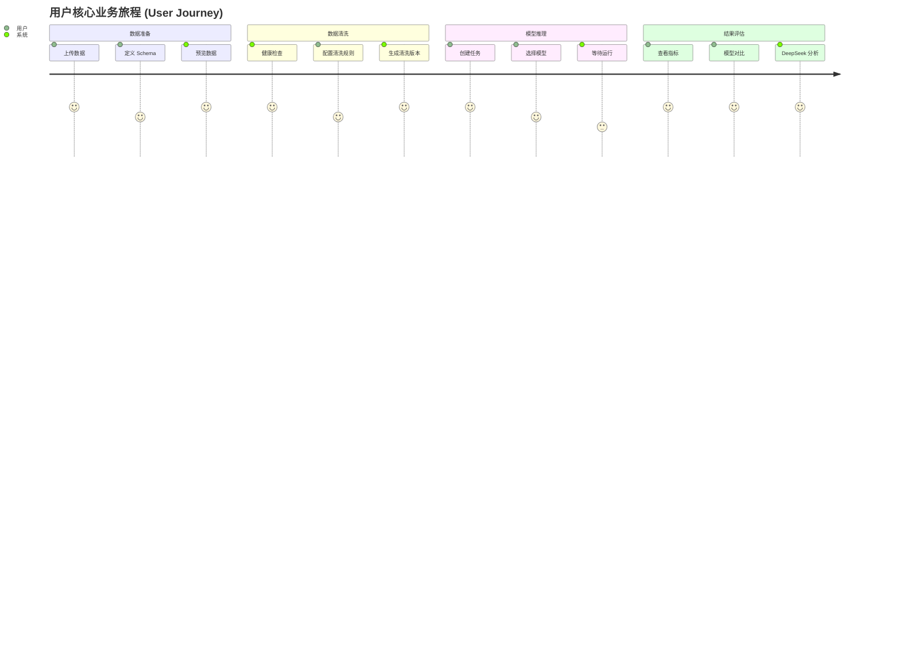

# LimiX 通用数据分析平台 PRD (v5.3)

| 文档版本 | 修改日期 | 修改人 | 修改内容 |
| :--- | :--- | :--- | :--- |
| V5.5 | 2026-01-04 | 智能助手 | 功能增强：在 8.6 因果解释模块增加“特征归因分析配置”功能，支持自定义特征交互分析 |
| V5.4 | 2025-12-26 | 智能助手 | UI 文案优化：更新数据资产页按钮文案及导航栏标题，调整清洗规则展示顺序 |
| V5.3 | 2025-12-26 | 智能助手 | 结构调整：将“因果解释”模块前置至 8.6，将“对比分析”模块后置至 8.7，与系统导航顺序保持一致 |
| V5.2 | 2025-12-26 | 智能助手 | 修正功能模块：移除 8.8 交付 (Delivery) 模块，该功能当前已隐藏，不应包含在文档中 |
| V5.1 | 2025-12-26 | 智能助手 | 新增功能模块：补全 8.7 因果解释 (Causal Explanation) 模块，与系统功能保持一致 |
| V5.0 | 2025-12-26 | 智能助手 | 修正功能模块：移除 8.1.3 中关于顶部栏（场景/模式）的描述，与实际页面布局保持一致 |
| V4.9 | 2025-12-26 | 智能助手 | 全局走查修正：新增“对比分析”模块，补充数据漂移、热力图及具体清洗规则类型，统一“可搏高价”等业务术语 |

## 1. 文档介绍
| V4.8 | 2025-12-26 | 智能助手 | 全局走查修正：对齐系统实际页面，拆分数据体检与清洗模块，移除未实现的解释与交付模块 |
| V4.7 | 2025-12-26 | 智能助手 | 修正功能模块：重写数据清洗模块的功能列表与UI详述，匹配实际的一键清洗流程 |
| V4.6 | 2025-12-26 | 智能助手 | 修正功能模块：移除“场景切换”相关描述，简化顶部导航定义 |
| V4.5 | 2025-12-26 | 智能助手 | 修正功能模块：移除“Schema 编辑”功能，与实际系统保持一致 |
| V4.4 | 2025-12-26 | 智能助手 | 功能完善：在数据资产模块补充数据上传、当前数据选择及字段字典的功能描述 |
| V4.3 | 2025-12-26 | 智能助手 | 修正功能模块：移除“特征工程”模块，与实际系统保持一致 |
| V4.2 | 2025-12-26 | 智能助手 | 结构化重构：将页面元素详述直接整合至各功能模块说明中，删除独立的第9章 |
| V4.1 | 2025-12-26 | 智能助手 | 修复文档格式问题，确保 Word 导出兼容性 |
| V4.0 | 2025-12-26 | 智能助手 | 按照标准 PRD 结构（8大章节）重构文档，整合 PM 视角描述、枚举定义及详细功能点 |
| V3.2 | 2025-12-26 | 智能助手 | 新增用户画像、产品价值描述 |
| V3.1 | 2025-12-26 | 智能助手 | 补充操作限制条件 (Restrictions) 及校验逻辑 |
| V3.0 | 2025-12-26 | 智能助手 | 初始版本，基于代码反向生成 |

---

## 1. 文档介绍
基于 LimiX 核心算法能力，构建一个面向结构化数据的端到端机器学习平台，支持从数据管理、自动清洗、模型训练到结果评估的完整工作流程。平台旨在降低机器学习门槛，为数据分析师和业务人员提供“白盒化”、“可解释”且“高精度”的预测分析解决方案。

## 2. 产品价值
平台致力于解决传统机器学习落地难的痛点，提供以下核心价值：
*   **单一可信源 (SSOT)**：通过强制版本管理和场景隔离，构建“数据安全屋”，消除版本混乱。
*   **自动化脏活累活**：内置专家级清洗规则，自动处理缺失、异常、格式问题，将数据准备时间从数天缩短至数分钟。
*   **极简建模体验**：无需编写代码，通过向导式流程即可完成高性能模型的训练与推理。
*   **决策辅助与信任**：通过可解释性模块，让业务人员不仅知其然，更知其所以然。

## 3. 目标用户
*   **业务分析师 (Business Analyst)**：懂业务但不懂代码，希望快速验证假设，预测业务指标（如销量、价格）。
*   **运营经理 (Operations Manager)**：关注核心 KPI，需要依赖数据模型辅助决策（如用户流失预警）。
*   **初级算法工程师**：需要快速搭建 Baseline 模型，验证数据可行性。

**核心痛点**：
1.  **数据处理难**：面对原始脏数据束手无策。
2.  **建模门槛高**：被复杂的算法参数劝退。
3.  **信任成本高**：不信任“黑盒”模型的预测结果。

## 4. 名词解释

| 术语 | 定义 | 备注 |
| :--- | :--- | :--- |
| **Schema (元数据)** | 描述数据表结构的定义，包括字段名、数据类型、业务语义等。 | 平台核心校验依据 |
| **Feature (特征)** | 用于模型输入的数据字段，通常指自变量 (X)。 | |
| **Label (标签)** | 模型需要预测的目标字段，通常指因变量 (y)。 | |
| **Baseline (基线)** | 用于对比模型效果的基础标准，通常指简单的统计模型或现有业务规则。 | |
| **One-Hot 编码** | 将分类变量转换为二进制向量的处理方法。 | 数据清洗常用手段 |
| **AUC/ROC** | 分类模型的核心评估指标，衡量模型区分正负样本的能力。 | 越接近 1 越好 |

## 5. 系统总体架构图

```mermaid
graph TD
    User[业务用户] --> Web[Web 前端 (React + Arco Design)]
    Web --> Gateway[API 网关]
    Gateway --> Service[核心服务层]
    
    subgraph Service [核心服务层]
        DataManager[数据管理服务]
        CleanEngine[清洗引擎]
        TrainEngine[训练/推理引擎]
        EvalEngine[评估引擎]
    end
    
    subgraph Storage [存储层]
        OSS[对象存储 (原始文件)]
        DB[关系型数据库 (元数据)]
        Cache[Redis 缓存]
    end
    
    DataManager --> OSS
    DataManager --> DB
    CleanEngine --> DataManager
    TrainEngine --> CleanEngine
    EvalEngine --> TrainEngine
```

## 6. 系统业务流程图



## 7. 全局说明

### 7.1 权限与授权规则
*   基于 RBAC (Role-Based Access Control) 模型。
*   **普通用户**：仅可操作自己创建的项目和数据。
*   **管理员**：可管理所有项目，配置全局参数。

### 7.2 交互与 UI 规范
*   **设计系统**：Arco Design (React)。
*   **布局**：卡片式布局，操作按钮右上角，统一的面包屑导航。
*   **反馈**：
    *   成功操作：绿色 Message 提示。
    *   危险操作：二次确认 Modal 弹窗。
    *   加载状态：骨架屏 (Skeleton) 或 Loading Spin。

### 7.3 错误处理与提示规范
*   **前端校验**：表单输入实时校验（如必填项、格式错误）。
*   **接口异常**：统一拦截 HTTP 错误，展示友好的错误信息（非技术堆栈）。
*   **系统级错误**：如“服务不可用”，展示全局错误页或降级 UI。

### 7.4 全局数据字典与枚举

#### 7.4.1 任务类型 (TaskType)
| 枚举值 | 描述 | 适用场景 |
| :--- | :--- | :--- |
| `classification` | 分类任务 | 预测离散标签（如：高/低风险、是/否流失） |
| `regression` | 回归任务 | 预测连续数值（如：房价、销量、温度） |

#### 7.4.2 运行状态 (RunStatus)
| 枚举值 | 描述 | 前端展示颜色 |
| :--- | :--- | :--- |
| `pending` | 等待中 | 灰色 (Gray) |
| `running` | 运行中 | 蓝色 (Blue) + 动态加载 |
| `success` | 成功 | 绿色 (Green) |
| `failed` | 失败 | 红色 (Red) |

## 8. 功能说明

### 8.1 数据资产 (Data Assets)
#### 8.1.1 模块目标
作为平台的**单一可信源**，负责原始数据的接入、版本管理和场景隔离。确保后续流程基于正确、一致的数据集进行。

#### 8.1.2 功能列表与描述
| 功能点 | 描述 | 按钮/操作 | 字段说明 |
| :--- | :--- | :--- | :--- |
| **数据上传** | 支持上传本地 CSV/Excel 文件作为原始数据集。 | "上传数据集" 按钮 | 文件路径、文件名称 |
| **数据列表** | 展示当前场景下的所有数据表及其元信息。 | 列表视图 | 表名、大小、行数、**时间范围**、**负责人**、**体检分** |
| **字段字典** | 展示数据的元数据定义 (Schema)，包括字段名、类型和缺失率。 | "Schema" 面板 | 字段名 (Field)、类型 (Type)、缺失 (Missing) |


#### 8.1.4 操作限制 (Restrictions)
*   **唯一性**：同一场景下，数据表名称不可重复。
*   **不可变性**：已发布的数据版本不可修改，只能创建新版本。


### 8.2 数据评估 (Data Evaluation)
#### 8.2.1 模块目标
**全面体检**。自动扫描数据质量问题，生成可视化的健康报告，帮助用户快速了解数据状况。

#### 8.2.2 功能列表与描述
| 功能点 | 描述 | 按钮/操作 | 字段说明 |
| :--- | :--- | :--- | :--- |
| **一键体检** | 自动扫描缺失值、异常值、重复率等质量问题。 | "一键体检" 按钮 | 产出：综合质量分 (Score) |
| **质量概览** | 通过仪表盘和图表展示数据健康状况。 | 自动展示 | 评分、异常项统计、**PSI 漂移** |
| **缺失热力图** | 可视化展示缺失值的分布模式（时间 x 特征）。 | 热力图视图 | X轴: 特征, Y轴: 时间, 颜色: 缺失程度 |
| **数据预览** | 查看原始数据样本，辅助人工核查。 | "数据概览" 选项卡 | 前 10 行样本数据 |

#### 8.2.3 界面元素详述 (UI Specifications)
| 区域 | 元素名称 | 类型 | 数据来源/默认值 | 交互/逻辑说明 |
| :--- | :--- | :--- | :--- | :--- |
| **概览区** | 综合质量分 | Ring Progress | `health.score` | 0-100 分，动态颜色（红/黄/绿）。 |
| **概览区** | 核心指标卡 | Statistic | `health.metrics` | 展示缺失率、异常率、重复率、**口径不一致**。 |
| **详情区** | 缺失热力图 | Heatmap | `health.missingHeat` | 红蓝热力图展示字段缺失的时间分布。 |
| **详情区** | 数据漂移 | LineChart | `health.drift` | 展示 PSI 指标随时间的变化趋势。 |

---

### 8.3 数据清洗 (Data Cleaning)
#### 8.3.1 模块目标
**自动化修复**。基于体检结果，提供智能清洗规则建议，一键生成高质量的清洗版本。

#### 8.3.2 功能列表与描述
| 功能点 | 描述 | 按钮/操作 | 字段说明 |
| :--- | :--- | :--- | :--- |
| **规则建议** | 系统自动推荐的清洗规则（去重、单位映射、插值填补、盖帽法）。 | 规则卡片 | `Type`: Deduplicate, Map, Fill, Outlier |
| **变更预览** | 预览清洗规则应用后的数据变化及影响行数。 | "变更预览" | `Impact`: 影响行数, `Diff`: 指标变化 |
| **一键清洗** | 执行所有启用规则，生成新的数据版本 (V2)。 | "一键清洗" 按钮 | 产出：V2 数据集 |

#### 8.3.3 界面元素详述 (UI Specifications)
| 区域 | 元素名称 | 类型 | 数据来源/默认值 | 交互/逻辑说明 |
| :--- | :--- | :--- | :--- | :--- |
| **控制区** | 一键清洗按钮 | Button | - | 触发清洗任务，成功后自动切换至 V2 版本。 |
| **规则区** | 规则卡片 | Card | `cleanRules` | 展示规则名称、类型、风险等级 (`Risk`: Low/Mid/High) 及启用状态。 |
| **预览区** | 影响统计 | Statistic | `impact` | 展示预计修复的行数及质量提升预期。 |
| **历史区** | 清洗记录 | List | `history` | 展示清洗操作的历史记录。 |

---

### 8.4 推理任务 (Inference Tasks)
#### 8.4.1 模块目标
**极简建模**。无需编写代码，通过配置化向导启动高性能的模型训练或推理任务。

#### 8.4.2 功能列表与描述
| 功能点 | 描述 | 按钮/操作 | 字段说明 |
| :--- | :--- | :--- | :--- |
| **任务创建** | 配置并启动一个新的机器学习任务。 | "运行" 按钮 | `Task Name`: 任务名, `Target`: 目标列 |
| **模型选择** | 选择内置的高性能算法模型。 | 卡片选择 | 支持：**Limix** (自研), **AutoGluon** (自动ML), **DeepSeek** (大模型) |
| **特征选择** | 选择参与训练的特征字段。 | 复选框 | `Features`: 选中的列名 |

#### 8.4.3 界面元素详述 (UI Specifications)
| 区域 | 元素名称 | 类型 | 数据来源/默认值 | 交互/逻辑说明 |
| :--- | :--- | :--- | :--- | :--- |
| **配置区** | 任务名称 | Input | 默认："任务_类型" | 输入任务标识。 |
| **配置区** | 任务类型 | Select | [时序预测, 分类, 回归] | 决定后续的可选参数。 |
| **配置区** | 目标列 | Select | Schema Columns | 选择预测目标 (Label)。 |
| **模型区** | 模型卡片 | Card | `MODELS` | 展示模型名称、简介及适用场景。支持单选/多选。 |
| **列表区** | 任务列表 | List | `runs` | 展示任务状态、耗时及核心指标 (AUC/RMSE)。 |

#### 8.4.4 操作限制 (Restrictions)
*   **模式影响**：极速模式 (Quick Mode) 下训练速度快但精度略低；精准模式反之。

---

### 8.5 推理结果 (Inference Results)
#### 8.5.1 模块目标
**结果洞察**。通过可视化图表展示模型预测结果，提供特征重要性分析及最佳阈值建议。

#### 8.5.2 功能列表与描述
| 功能点 | 描述 | 按钮/操作 | 字段说明 |
| :--- | :--- | :--- | :--- |
| **最佳阈值** | 针对分类任务，自动推荐实现最大收益的分类阈值。 | 滑块/卡片 | `Threshold`: 0.0-1.0, `Benefit`: 预期收益 |
| **特征重要性** | 展示影响模型预测结果的核心因子。 | 条形图 | `Feature`: 特征名, `Importance`: 权重 |
| **预测详情** | 展示具体的预测数据分布及分类结果。 | 散点图 | `X`: 时间/样本, `Y`: 预测值/类别 |

#### 8.5.3 界面元素详述 (UI Specifications)
| 区域 | 元素名称 | 类型 | 数据来源/默认值 | 交互/逻辑说明 |
| :--- | :--- | :--- | :--- | :--- |
| **阈值区** | 收益模拟器 | Slider | `MOCK_THRESHOLD` | 拖动阈值滑块，实时计算预期收益。 |
| **图表区** | 特征重要性 | BarChart | `feature_importance` | 展示 Top 特征对结果的贡献度。 |
| **图表区** | 预测散点图 | ScatterChart | `predictions` | **分类任务**：展示“**可搏高价 (1)**”与“**不可搏高价 (0)**”的分布。<br>**回归任务**：展示预测值与真实值的拟合曲线。 |
| **AI区** | DeepSeek 建议 | Text | Mock String | 展示大模型对当前结果的智能分析与建议。 |

---

### 8.6 因果解释 (Causal Explanation)
#### 8.6.1 模块目标
**归因分析**。揭示模型预测结果背后的驱动因素，分析特征对目标变量的影响程度，回答“为什么”并为业务治理提供依据。

#### 8.6.2 功能列表与描述
| 功能点 | 描述 | 按钮/操作 | 字段说明 |
| :--- | :--- | :--- | :--- |
| **任务选择** | 选择需要进行归因分析的历史任务。 | 下拉选择框 | 展示任务名、ID、状态、版本等信息。 |
| **特征交互** | 支持用户自定义选择特征字段，实时生成定制化的热力图与分数对比图。 | 复选框/按钮 | `Selection`: 选中特征列表 |
| **热力图分析** | 全局视角展示影响因子的时序/类别分布模式。 | 自动渲染 | `Rows`: 时间/批次, `Cols`: 影响因子, `Color`: 影响强度 |
| **排名对比** | 量化展示各因子的总体影响分数。 | 自动渲染 | `Y`: 因子名称, `X`: 影响分数 (正负双向) |

#### 8.6.3 界面元素详述 (UI Specifications)
| 区域 | 元素名称 | 类型 | 数据来源/默认值 | 交互/逻辑说明 |
| :--- | :--- | :--- | :--- | :--- |
| **信息区** | 任务详情卡 | Card | `currentRun` | 展示选定任务的 ID、类型、状态、数据版本及起止时间。 |
| **配置区** | 特征选择面板 | Checkbox Group | `MOCK_INFLUENCE_FACTORS` | 提供全选/清空/单选功能，支持按需筛选分析维度。 |
| **配置区** | 生成按钮 | Button | - | 点击触发图表数据更新。 |
| **图表区** | 影响因子热力图 | DivergingHeatGrid | `MOCK_HEATMAP` | **红蓝双色**热力图，直观展示因子在不同时间点的影响力分布。 |
| **图表区** | 影响分数条形图 | BarChart | `MOCK_INFLUENCE_SCORES` | 水平条形图，红色代表正向促进，蓝色代表负向抑制。 |

---

### 8.7 对比分析 (Contrastive Analysis)
#### 8.7.1 模块目标
**价值证明**。通过多维度（精度、时间、可解释性）对比 LimiX 自研模型与开源 AutoML 及通用 LLM 的表现，证明平台优势。

#### 8.7.2 功能列表与描述
| 功能点 | 描述 | 按钮/操作 | 字段说明 |
| :--- | :--- | :--- | :--- |
| **模型PK** | 直观展示不同模型方案在关键指标上的得分对比。 | 自动展示 | 维度：训练时间、Metric (MAPE/Accuracy)、可解释性、交付能力 |
| **趋势对比** | 在时间轴上对比真实值 (Truth) 与各模型预测值的拟合程度。 | 图表切换 | `Series`: Truth, LimiX, AutoGluon, LLM |
| **差异点分析** | 高亮展示 LimiX 预测准确但其他模型预测错误的具体样本。 | 散点图 | 标记点：High Price / Low Price |

#### 8.7.3 界面元素详述 (UI Specifications)
| 区域 | 元素名称 | 类型 | 数据来源/默认值 | 交互/逻辑说明 |
| :--- | :--- | :--- | :--- | :--- |
| **对比区** | 评估矩阵卡片 | Card Grid | `MOCK_COMPARE` | 展示 **LimiX** vs **AutoGluon** vs **通用LLM** 的多维对比。LimiX 卡片高亮显示。 |
| **图表区** | 趋势拟合图 | LineChart | `MOCK_MODEL_COMPARISON` | 展示多条折线，直观对比预测准确性。 |
| **图表区** | 分类差异图 | ScatterChart | `MOCK_CLF_COMPARISON_POINTS` | 展示分类任务中各模型的预测分布差异。 |
