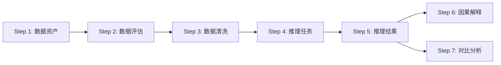
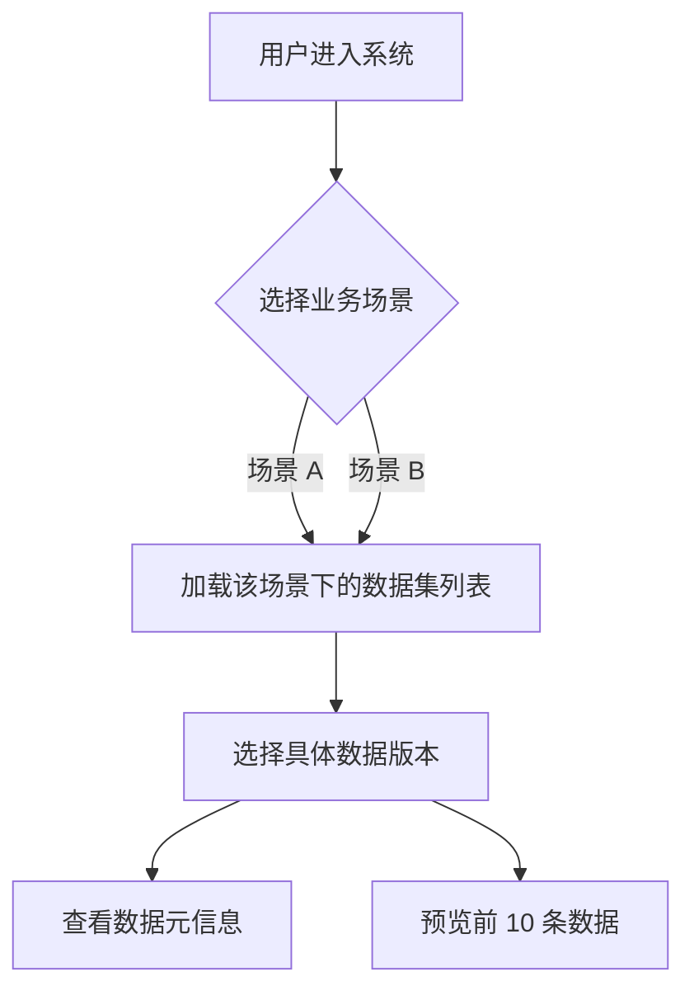
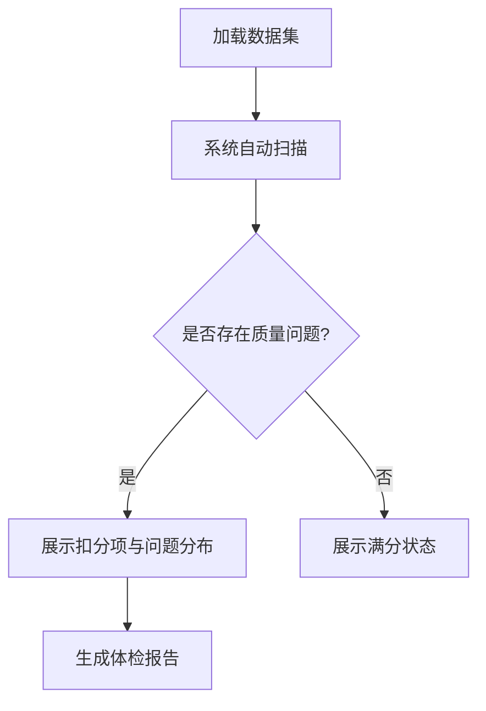
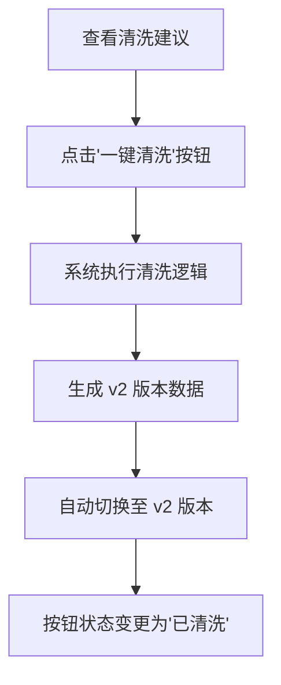

# LimiPreview 系统产品需求文档 (PRD)

| 版本号 | 日期       | 修改人 | 修改内容                                                     |
| :----- | :--------- | :----- | :----------------------------------------------------------- |
| V1.0   | 2025-12-25 | 戴     | 初版发布，定义核心 MVP 功能                                  |
| V2.0   | 2025-12-26 | 戴     | 按照工程化交付标准重构，包含7大模块详细定义与数据结构 |
| V2.1   | 2025-12-26 | 戴     | 补充按钮说明、字段枚举表、操作限制及截图占位                 |

## 一、 业务流程总览

LimiPreview 旨在为非算法专家提供一站式的“数据导入 -> 质量体检 -> 智能清洗 -> 自动建模 -> 结果归因”全流程体验。



---

## 二、 功能模块详解

### 3.1 数据资产 (Data Assets)

#### 3.1.1 模块目标
管理多场景下的数据集版本，提供数据的基本元信息概览，支持用户快速切换不同的业务场景（如电价预测、分类预测）。

#### 3.1.2 功能流程图


#### 3.1.3 功能说明
*   **场景切换**：顶部导航栏支持切换不同的业务场景（如“山东省日前电价预测”）。
*   **版本管理**：每个场景下包含多个数据版本（如“v1（含脏数据）”、“v2（清洗后）”）。
*   **数据预览**：以表格形式展示数据集的前 10 行，直观呈现数据样貌。

> 🖼️ [截图占位: 顶部导航栏场景选择与数据版本下拉框]

#### 3.1.4 界面元素与交互
| 元素名称 | 类型 | 说明 | 交互反馈 |
| :--- | :--- | :--- | :--- |
| **场景选择器** | Dropdown | 选择业务场景 (Scene) | 切换后自动选中该场景下最新的数据集版本 |
| **数据版本选择器** | Dropdown | 选择数据集版本 (Dataset) | 切换后页面所有模块的数据源实时更新 |
| **元信息卡片** | Card | 展示行数、列数、时间范围、负责人 | 无 |

#### 3.1.5 字段说明
| 字段名 | 类型 | 示例值 | 说明 |
| :--- | :--- | :--- | :--- |
| `sceneId` | String | `sd_price` | 业务场景唯一标识 |
| `version` | String | `v1（含脏数据）` | 数据版本描述 |
| `qualityScore` | Number | `62` | 数据质量评分 (0-100) |

---

### 3.2 数据评估 (Data Health)

#### 3.2.1 模块目标
自动扫描数据中的质量问题，量化数据健康度，为后续清洗提供依据。

#### 3.2.2 功能流程图


#### 3.2.3 功能说明
*   **自动体检**：系统根据预设规则（缺失率、重复率、异常值）自动计算扣分项。
*   **问题可视化**：通过进度条和颜色（红/黄/绿）直观展示各项指标的健康程度。

> 🖼️ [截图占位: 数据体检得分仪表盘与扣分项列表]

#### 3.2.4 限制条件
*   **只读**：用户不可在此页面修改数据，仅可查看问题。

---

### 3.3 数据清洗 (Data Cleaning)

#### 3.3.1 模块目标
提供傻瓜式的“一键清洗”功能，自动修复数据评估阶段发现的问题，并生成新的数据版本。

#### 3.3.2 功能流程图


#### 3.3.3 功能说明
*   **规则展示**：列出系统推荐的清洗规则（如“去重”、“缺失填补”）。
*   **一键执行**：用户无需编写代码，点击按钮即可应用所有规则。
*   **效果对比**：展示清洗前后的指标变化（如“重复 1.5% -> 0.0%”）。

> 🖼️ [截图占位: 清洗规则列表与一键清洗按钮交互]

#### 3.3.4 按钮说明
| 按钮名称 | 初始状态 | 点击后状态 | 触发逻辑 | 限制条件 |
| :--- | :--- | :--- | :--- | :--- |
| **一键清洗** | `Normal` (可点击) | `Loading` (清洗中) -> `Disabled` (已清洗) | 触发 `handleClean` 函数，模拟 1.5s 耗时 | 仅在当前版本为 v1 (未清洗) 时可用；清洗完成后不可重复点击 |

#### 3.3.5 字段说明
| 字段名 | 类型 | 说明 |
| :--- | :--- | :--- |
| `before` | String | 清洗前指标描述 (e.g. "重复 1.5%") |
| `after` | String | 清洗后指标描述 (e.g. "重复 0.0%") |
| `risk` | Enum | 操作风险等级 (低/中/高) |

---

### 3.4 推理任务 (Inference Tasks)

#### 3.4.1 模块目标
定义并提交机器学习任务，支持选择不同的算法模型（LimiX, AutoGluon, DeepSeek 等）。

#### 3.4.2 功能流程图
```mermaid
graph TD
    A[点击'创建新任务'] --> B[填写任务名称]
    B --> C[选择目标列 (Target)]
    C --> D[选择模型框架]
    D --> E[点击'立即运行']
    E --> F[任务进入队列]
    F --> G[任务状态变更: 排队 -> 运行中 -> 完成]
```

#### 3.4.3 功能说明
*   **任务配置**：支持配置任务名称、任务类型（回归/分类）、目标列。
*   **模型选择**：支持多选模型进行训练。
*   **任务列表**：展示所有历史任务及其状态、耗时、核心指标。

> 🖼️ [截图占位: 任务创建弹窗与任务列表]

#### 3.4.4 按钮说明
| 按钮名称 | 说明 | 限制条件 |
| :--- | :--- | :--- |
| **创建新任务** | 打开任务配置抽屉 | 无 |
| **立即运行** | 提交任务至后台队列 | 必须填写任务名称并选择至少一个模型 |

#### 3.4.5 枚举字典: 任务类型 (TaskType)
| 枚举值 | 说明 |
| :--- | :--- |
| `regression` | 回归任务 (预测数值) |
| `classification` | 分类任务 (预测类别) |
| `timeseries` | 时序预测 (含时间轴) |
| `imputation` | 缺失值填补 |

---

### 3.5 推理结果 (Inference Results)

#### 3.5.1 模块目标
可视化展示模型的预测结果，评估模型性能。

#### 3.5.2 功能说明
*   **结果概览**：展示 RMSE, MAPE, AUC 等核心指标。
*   **趋势图/散点图**：
    *   **回归任务**：展示预测值与置信区间 (Confidence Interval)。
    *   **分类任务**：展示分类结果散点图 (Scatter Plot)。
*   **DeepSeek 对比**：专门展示 LimiX 与 DeepSeek 模型的性能对比。

> 🖼️ [截图占位: 预测趋势图与 DeepSeek 对比卡片]

#### 3.5.3 限制条件
*   **DeepSeek 限制**：DeepSeek 模型在回归任务上目前仅作为对比基线，不建议用于生产环境（文档中明确标注其不稳定性）。

---

### 3.6 因果解释 (Causal Explanation)

#### 3.6.1 模块目标
解释模型决策的依据，通过特征重要性和归因分析，增强模型的可解释性。

#### 3.6.2 功能说明
*   **特征重要性**：展示对预测结果影响最大的 Top N 特征。
*   **单样本归因**：(Mock) 展示特定样本的预测值是如何被各个特征贡献累加而成的。

> 🖼️ [截图占位: 特征重要性条形图]

---

### 3.7 对比分析 (Comparative Analysis)

#### 3.7.1 模块目标
深度对比不同模型在同一数据集上的表现，辅助用户选型。

#### 3.7.2 功能说明
*   **多模型同屏**：在同一图表中绘制真实值、LimiX 预测值、AutoGluon 预测值。
*   **X 轴优化**：针对密集时间点，自动调整 X 轴标签密度（每 5 个点显示一个），防止文字重叠。
*   **表格对比**：详细列出各模型在 AUC, ACC, F1 等指标上的具体数值。

> 🖼️ [截图占位: 多模型折线对比图]

---

## 三、 全局枚举字典

### 4.1 任务状态 (RunStatus)
| 状态值 | 中文说明 | 颜色标识 (Badge) |
| :--- | :--- | :--- |
| `completed` | 已完成 | Green |
| `running` | 运行中 | Blue |
| `queued` | 排队中 | Gray |
| `failed` | 失败 | Red |
| `archived` | 已归档 | Slate |

### 4.2 风险等级 (RiskLevel)
| 等级 | 说明 | 颜色 |
| :--- | :--- | :--- |
| `low` | 低风险 (如去重) | Green |
| `medium` | 中风险 (如填补) | Yellow |
| `high` | 高风险 (如删除列) | Red |

---

## 四、 非功能性需求

1.  **响应速度**：所有页面交互（除模型训练外）需在 1s 内完成响应。
2.  **Mock 数据一致性**：系统目前使用 Mock 数据，需保证不同模块间（如任务列表与结果详情）展示的数据 ID 和状态一致。
3.  **浏览器兼容性**：优先适配 Chrome 80+ 及 Edge 浏览器。
