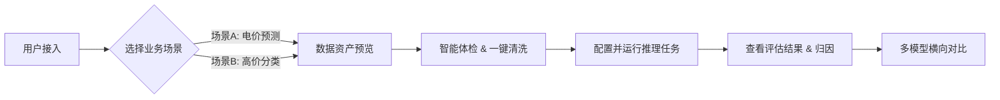
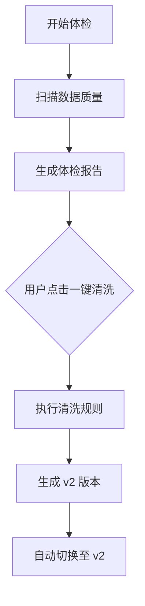

# LimiPreview 智能数据分析平台产品需求文档 (PRD)

| 文档版本 | V3.0 |
| :--- | :--- |
| **文档状态** | ✅ 已发布 (Released) |
| **最后更新** | 2025-12-26 |
| **负责人** | Senior PM |
| **开发团队** | 全栈开发组 |

---

## 1. 产品综述 (Product Overview)

### 1.1 产品背景
LimiPreview 致力于解决非算法背景业务人员在使用机器学习技术时的“高门槛”痛点。通过封装复杂的算法流程，提供“开箱即用”的**数据清洗、自动建模、结果归因**能力，帮助用户快速验证业务假设（如电价预测、销量预测等）。

### 1.2 核心价值主张 (Value Proposition)
*   **低门槛**：零代码操作，向导式流程。
*   **透明化**：白盒化展示清洗规则与模型决策依据。
*   **可对比**：直观对比 LimiX 专有模型与通用开源模型（AutoGluon/DeepSeek）的性能差异。

### 1.3 业务流程图 (User Journey Map)


---

## 2. 功能模块详情 (Functional Requirements)

### 2.1 模块一：数据资产 (Data Assets)

#### 2.1.1 模块目标
建立多场景、多版本的数据管理中心，确保用户操作的是正确且最新的业务数据。

#### 2.1.2 详细功能说明
| 功能点 | 优先级 | 详细描述 | 验收标准 (AC) |
| :--- | :--- | :--- | :--- |
| **场景切换** | P0 | 顶部导航栏提供场景选择下拉框，支持切换不同业务域。 | 1. 切换场景后，页面 URL 参数需同步更新。<br>2. 自动加载该场景下最新的数据版本。 |
| **版本控制** | P0 | 支持查看数据的不同版本状态（如 v1-原始 / v2-清洗后）。 | 1. 版本切换无延迟。<br>2. 不同版本需显示对应的质量评分 (Quality Score)。 |
| **数据预览** | P1 | 以 DataGrid 形式展示前 10 条样本数据。 | 1. 列宽自适应。<br>2. 支持横向滚动查看所有特征列。 |

#### 2.1.3 界面交互示意


---

### 2.2 模块二：数据清洗 (Data Cleaning)

#### 2.2.1 模块目标
通过自动化规则引擎，将“脏数据”转化为“模型可用数据”，降低人工处理成本。

#### 2.2.2 核心流程


#### 2.2.3 清洗规则逻辑
| 规则ID | 规则名称 | 触发条件 | 处理动作 | 风险等级 |
| :--- | :--- | :--- | :--- | :--- |
| R-001 | **去重处理** | 检测到 `Time` 字段重复 | 保留最新时间戳的一条数据 | Low |
| R-002 | **单位统一** | 检测到单位混用 (kW/MW) | 统一转换为 MW | Low |
| R-003 | **缺失填补** | 缺失率 > 0% 且 < 10% | 使用线性插值 (Linear Interpolation) 填补 | Medium |
| R-004 | **异常修正** | 负荷值 < 0 | 修正为 0 | Medium |

#### 2.2.4 按钮交互规范
*   **按钮文案**：`应用生成 v2`
*   **状态流转**：
    *   `Idle` (默认): 蓝色高亮，可点击。
    *   `Loading` (清洗中): 显示转圈动画，文案变为“清洗中...”，不可点击。
    *   `Disabled` (已完成): 灰色置灰，文案变为“已生成 v2”，不可点击。
*   **交互限制**：仅当当前数据版本为 `v1` 时才可操作。

#### 2.2.5 界面交互示意


---

### 2.3 模块三：推理任务 (Inference Tasks)

#### 2.3.1 模块目标
提供标准化的模型训练入口，屏蔽底层算法超参数配置，实现“一键训练”。

#### 2.3.2 详细功能说明
| 功能点 | 优先级 | 详细描述 | 验收标准 (AC) |
| :--- | :--- | :--- | :--- |
| **任务创建** | P0 | 支持自定义任务名称、选择目标列 (Label)。 | 1. 任务名称必填。<br>2. 目标列需从数据 Schema 中自动读取。 |
| **模型选择** | P0 | 提供模型复选框 (LimiX / AutoGluon / DeepSeek)。 | 1. 至少选择一个模型才能提交任务。 |
| **任务队列** | P1 | 展示任务运行状态流转。 | 1. 状态变更顺序：排队中 -> 运行中 -> 已完成。<br>2. 失败任务需显示错误提示。 |

#### 2.3.3 界面交互示意


---

### 2.4 模块四：结果评估与对比 (Evaluation & Comparison)

#### 2.4.1 模块目标
多维度展示模型性能，帮助用户决策选择最佳模型。

#### 2.4.2 可视化需求
*   **时序预测图** (针对回归任务)：
    *   X轴：时间 (Time)。
    *   Y轴：预测值 (Value)。
    *   图层：真实值 (虚线) vs 预测值 (实线) vs 置信区间 (阴影)。
    *   **交互优化**：当数据点密集时，X轴 Label 需自动降采样 (Step=5) 以防重叠。
*   **散点分布图** (针对分类任务)：
    *   区分正负样本，使用不同颜色/形状标识。

#### 2.4.3 深度对比 (Deep Dive)
*   **DeepSeek 对比卡片**：
    *   明确展示 LimiX 与 DeepSeek 在同一数据集上的推理耗时对比。
    *   展示 DeepSeek 的稳定性说明文案。

#### 2.4.4 界面交互示意


---

## 3. 数据字典 (Data Dictionary)

### 3.1 全局枚举 (Enums)

#### TaskType (任务类型)
| Key | Value | Description |
| :--- | :--- | :--- |
| `regression` | 回归预测 | 预测连续数值（如电价） |
| `classification` | 分类预测 | 预测离散类别（如高价/低价） |

#### RunStatus (运行状态)
| Key | Value | UI Color |
| :--- | :--- | :--- |
| `queued` | 排队中 | Gray |
| `running` | 运行中 | Blue (Pulse) |
| `completed` | 已完成 | Green |
| `failed` | 失败 | Red |

### 3.2 核心实体 (Entities)

#### Dataset (数据集)
```typescript
interface Dataset {
  id: string;          // 数据集唯一标识
  sceneId: string;     // 所属场景ID
  version: string;     // 版本号 (v1, v2)
  name: string;        // 显示名称
  qualityScore: number;// 质量评分 (0-100)
  rows: object[];      // 样本数据
}
```

---

## 4. 非功能性约束 (Non-Functional Requirements)

1.  **性能要求**：
    *   页面加载时间 < 1.5s。
    *   图表渲染延迟 < 300ms (在 1000 个数据点下)。
2.  **兼容性**：
    *   支持 Chrome 88+, Edge 90+, Safari 14+。
    *   分辨率适配：最小支持 1280x720，推荐 1920x1080。
3.  **安全性**：
    *   前端仅做数据脱敏展示（Mock 阶段忽略）。
    *   操作记录需本地持久化 (LocalStorage) 以防刷新丢失。
