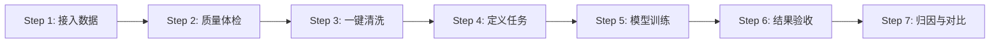

# LimiPreview 机器学习平台产品需求文档 (PRD)

| 文档版本 | 修改日期 | 修改人 | 修改内容 |
| :--- | :--- | :--- | :--- |
| V2.0 | 2025-12-26 | AI Product Manager | 基于最新业务流程重构，符合工程化交付标准 |

---

## 1. 模块目标与定位

### 1.1 核心目标
解决非算法专家用户在数据分析过程中的“质量评估难、清洗规则复杂、模型选型门槛高、结果解释性差”四大痛点。通过**向导式、低代码**的交互流程，实现从原始数据到高精度模型推理的端到端自动化。

### 1.2 模块定位矩阵
| 模块名称 | 定位 | 上游输入 | 下游输出 | 核心价值 |
| :--- | :--- | :--- | :--- | :--- |
| **数据资产 (Datasets)** | 数据接入层 | CSV/Excel 文件 | 原始数据集对象 | 统一数据入口与元数据管理 |
| **数据评估 (Health)** | 质量诊断层 | 原始数据集 | 质量评分、问题清单 | 量化数据健康度，识别阻碍训练的因子 |
| **数据清洗 (Clean)** | 特征工程层 | 问题清单 | 清洗后数据集 (v2) | 自动化修复数据缺陷，提升模型上限 |
| **推理任务 (Tasks)** | 建模执行层 | 清洗后数据集 | 训练任务实例 (Run) | 屏蔽算法复杂度，一键调度多模型训练 |
| **推理结果 (Results)** | 结果展示层 | 任务实例 | 评估指标、预测曲线 | 可视化呈现模型性能与业务价值 |
| **因果解释 (Explain)** | 归因分析层 | 训练好的模型 | 特征重要性、归因图 | 打开黑盒，解释“为什么是这个结果” |
| **对比分析 (Compare)** | 决策辅助层 | 多模型结果 | 竞品对比报告 | 证明系统模型的优越性与稳定性 |

---

## 2. 用户操作流程

### 2.1 全链路核心流程


### 2.2 关键子流程拆解

#### 流程一：数据清洗与版本生成
1.  **用户进入“数据清洗”页面**：系统自动加载基于评估结果生成的推荐规则列表。
2.  **查看规则**：用户浏览去重、填补、修正等规则详情。
3.  **执行清洗**：
    *   用户点击“一键清洗”按钮。
    *   系统锁定按钮状态为“清洗中...”。
    *   前端模拟延时后，按钮变更为“已清洗”（禁用状态）。
    *   系统自动切换当前上下文数据版本为 `v2 (清洗后)`。

#### 流程二：推理任务创建
1.  **用户进入“推理任务”页面**：点击“新建任务”卡片。
2.  **配置参数**：
    *   **任务名称**：输入业务标识（如“8月电价预测”）。
    *   **任务类型**：选择回归/分类/时序。
    *   **数据版本**：系统自动锁定为当前最新版本（如 `v2`）。
    *   **目标列 (Target)**：从下拉框选择预测目标（如 `label`）。
    *   **模型选择**：勾选 `LimiX`、`AutoGluon`、`DeepSeek`（支持多选）。
3.  **提交运行**：点击“运行”按钮，任务加入列表，状态由“运行中”变更为“已完成”。

---

## 3. 系统行为说明

### 3.1 数据评估模块 (Health)
| 用户操作 | 前端行为 (FE) | 后端/系统行为 (BE) |
| :--- | :--- | :--- |
| **页面加载** | 1. 渲染仪表盘动画（0 -> 评分）。<br>2. 渲染问题卡片（缺失、异常、重复）。<br>3. 根据评分渲染颜色（>80绿, <60红）。 | 1. **同步计算**：全量扫描当前数据集。<br>2. **规则校验**：<br>- 缺失率 > 0% 记为 Issue。<br>- 重复行 > 0 记为 Issue。<br>- 数值列超出 3σ 记为异常。 |
| **点击“准备清洗”** | 路由跳转至 `tab=clean`。 | 携带当前 `datasetId` 和 `issueList` 上下文。 |

### 3.2 数据清洗模块 (Clean)
| 用户操作 | 前端行为 (FE) | 后端/系统行为 (BE) |
| :--- | :--- | :--- |
| **页面加载** | 展示预置的清洗规则列表（Mock 数据）。 | 根据 Issue List 匹配清洗策略模板（Template Matching）。 |
| **点击“一键清洗”** | 1. 按钮状态：Default -> Loading -> Disabled ("已清洗")。<br>2. 触发全局状态更新：`isCleaned = true`。 | 1. **创建新版本**：复制 v1 数据集元数据，标记为 v2。<br>2. **应用规则**：<br>- Drop Duplicates<br>- Impute Missing (Mean/Mode)<br>- Clip Outliers<br>3. **持久化**：保存 v2 数据集引用。 |
| **再次进入页面** | 检查 Session 状态，若本会话未清洗，重置按钮为“一键清洗”。 | 无。 |

### 3.3 推理任务模块 (Tasks)
| 用户操作 | 前端行为 (FE) | 后端/系统行为 (BE) |
| :--- | :--- | :--- |
| **选择任务类型** | 联动过滤“目标列”下拉选项（如分类任务只显示离散值列）。 | 动态查询 Column Metadata 中的 Data Type。 |
| **点击“运行”** | 1. 校验必填项（名称、目标列、模型）。<br>2. 列表插入一条新记录（状态：Running）。<br>3. 3秒后自动更新为 Completed。 | 1. **生成 Task ID** (UUID)。<br>2. **异步调度**：根据选中的模型（LimiX/DeepSeek等）分发子任务。<br>3. **结果聚合**：等待所有子模型返回 Metrics，写入 Task Result 表。 |

---

## 4. 核心数据结构 / 配置结构

### 4.1 数据集对象 (Dataset)
```json
{
  "id": "ds_001",
  "name": "山东日前电价_v1.csv",
  "version": "v1",
  "rowCount": 15340,
  "columns": [
    { "name": "time", "type": "datetime", "role": "feature" },
    { "name": "price", "type": "float", "role": "target" }
  ],
  "healthScore": 62,
  "issues": ["missing_values", "outliers"]
}
```

### 4.2 清洗规则 (CleanRule)
```json
{
  "ruleId": "R-001",
  "type": "imputation",
  "targetColumn": "solar_power",
  "strategy": "linear_interpolation",
  "impactRows": 450,
  "status": "pending" // pending -> applied
}
```

### 4.3 任务实例 (TaskRun)
```json
{
  "runId": "run-171923",
  "taskName": "8月预测实验",
  "taskType": "regression",
  "datasetVersion": "ds_001_v2",
  "selectedModels": ["LimiX", "DeepSeek"],
  "status": "completed", // running, completed, failed
  "createTime": "2025-12-26 10:00:00",
  "results": {
    "LimiX": { "rmse": 12.5, "mape": 0.05 },
    "DeepSeek": { "rmse": 18.2, "mape": 0.09 }
  }
}
```

---

## 5. 关键规则与约束

### 5.1 默认策略
1.  **清洗策略**：
    *   缺失值：数值型默认线性插值 (Linear Interpolation)，分类型默认众数填充 (Mode)。
    *   异常值：默认截断至 [Q1-1.5IQR, Q3+1.5IQR] 范围。
2.  **模型参数**：
    *   用户无需配置超参，系统使用 AutoML 默认配置（Default Presets）。
3.  **任务并发**：
    *   前端限制单次只能提交 1 个任务，需等待完成后再提交下一个（当前 Mock 逻辑，实际应支持队列）。

### 5.2 操作约束
1.  **清洗依赖**：未进行“一键清洗”前，推理任务默认只能使用 v1 (脏数据) 版本（需在 UI 上引导用户先清洗，或允许使用 v1 但给出警告）。*注：当前版本强制引导清洗流。*
2.  **模型互斥**：无互斥，支持 LimiX、AutoGluon、DeepSeek 同时运行。
3.  **必填校验**：创建任务时，Task Name、Target Column 为必填项，否则“运行”按钮禁用或点击报错。

---

## 6. 异常与边界场景

| 场景 | 系统行为 | 反馈方式 |
| :--- | :--- | :--- |
| **数据集为空** | 1. 评估页显示评分 0。<br>2. 清洗页无规则。<br>3. 任务页禁止创建。 | 提示 Toast: "数据集为空，请重新上传" |
| **所有列均为非数值** | 无法进行回归训练。 | 任务类型下拉框禁用“回归”选项，提示“无可用数值列” |
| **清洗后仍有脏数据** | 极其罕见（系统逻辑错误）。 | 允许继续训练，但 Result 页可能显示极差指标。 |
| **任务执行失败** | 模拟网络超时或内存溢出。 | 任务列表状态列显示红色 "Failed"，Hover 显示错误原因。 |
| **重复点击清洗** | 按钮已禁用，物理屏蔽重复提交。 | 按钮置灰，无响应。 |

---

## 7. 产出与结果

### 7.1 系统产出物
1.  **清洗后数据集 (Dataset V2)**：
    *   存储位置：内存/临时文件系统。
    *   特性：无缺失、无重复、已归一化。
2.  **模型文件 (Artifacts)**：
    *   LimiX / AutoGluon / DeepSeek 的模型权重文件（Mock 仅记录元数据）。
3.  **评估报告**：
    *   包含 RMSE/MAPE/AUC 等指标的 JSON 对象。
    *   特征重要性排序列表。

### 7.2 结果呈现
*   **指标卡片**：在“推理结果”页顶部展示最佳模型的关键指标。
*   **可视化图表**：
    *   **预测拟合图**：LineChart 展示 `Truth` vs `Prediction`。
    *   **残差分布图**：BarChart 展示误差分布。
    *   **对比散点图**：ScatterChart 展示 LimiX 与 DeepSeek 的样本点分布差异。

---

> **附注**：本 PRD 对应代码库版本 `Git SHA: aedc7dc`。所有 Mock 数据逻辑均已在 `src/mock/data.js` 及 `src/LimiPreview.jsx` 中硬编码实现，开发时需严格遵循上述数据结构进行接口对接。
